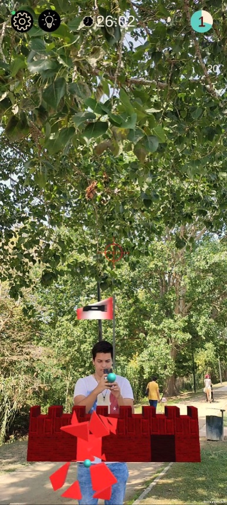

# Defend Your Castle AR 🏰📱

   
  

## Overview 🌐

With the rapid advancements in mobile technology and the rise of sophisticated communication infrastructures, **Mobile Augmented Reality (RAM)** applications have become a sensation. Coupled with the concept of "gamification", which aims to instill sustainable habits in individuals and communities, the stage was set for the birth of **Defend Your Castle AR**.

## About the Game 🎮

**Defend Your Castle AR** is a competitive multiplayer Mobile Augmented Reality (RAM) game designed for both entertainment and fostering communication. Inspired by the classic 1990 game, *Rampart*, this game revives the age-old thrill of building and defending castles. But this time, it's not just on a 2D screen - it's in augmented reality!

### Gameplay 🕹

- **Build Your Castle**: Erect formidable walls and towers to defend your kingdom.
- **Destroy the Enemy**: Use your cannons to bring down the enemy's castle.
- **Victory**: The player who razes the enemy castle to the ground emerges victorious!

## Technology Stack 🛠

- **Unity PUN**: Leveraged for its powerful networking capabilities.
- **Photon Engine**: Ensuring seamless multiplayer interactions.

## Usability Tests 📊

Post-development tests revealed that users found the **Defend Your Castle AR** experience to be highly satisfactory. Even those unfamiliar with mobile augmented reality found the gameplay intriguing and innovative on a mobile platform.

## Get Started 🚀

1. Clone the repository: `git clone https://github.com/Bruna248/DefendYourCastleAR.git`
2. Open the project in Unity.
3. Build and run on your preferred mobile device.
4. Dive into the AR world of castles and cannons!

---

Developed with ❤️ by Bruna Leitão & Carlos Costa
